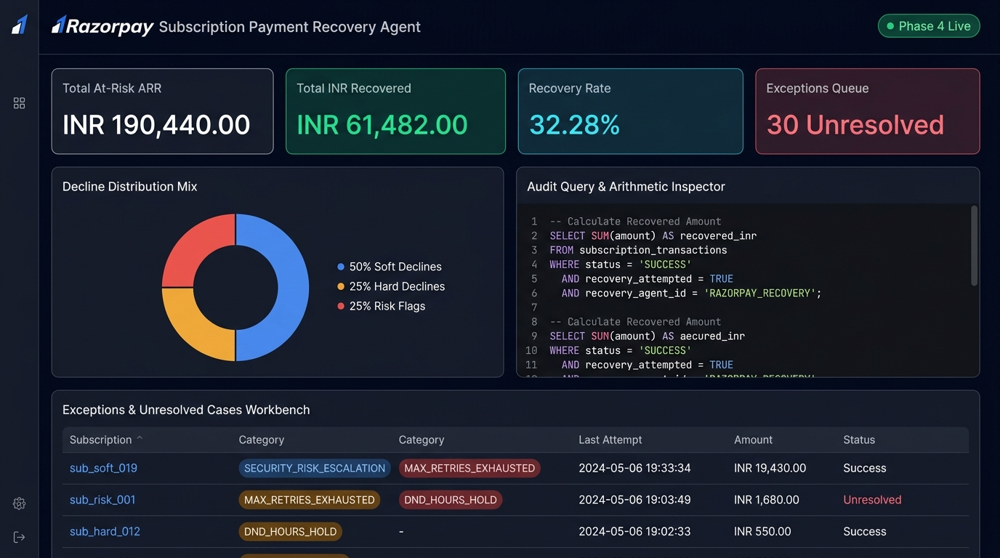

# RECOVERX
### AI Revenue Recovery Agent for Razorpay Subscriptions

[](https://github.com/SaiSankeerth-dev/Razorpay_demo/actions)
[](LICENSE)
[](https://www.python.org/)
[](https://razorpay.com)

> **Recover failed subscription revenue with AI-guided recovery decisions while deterministic financial policies prevent unsafe actions.**  
> AI provides contextual judgment. Deterministic policy provides financial authority.

<p align="center">
  
</p>

---

### 📊 3-Arm Benchmark Evidence (Held-Out Test Set: 150 Scenarios)

Evaluated across **150 held-out subscription failure scenarios** comparing legacy **Naive Fixed Retry**, deterministic **Rules-Only (Classifier + Policy)**, and the **AI Recovery Agent + Policy Firewall**:

| Key Performance Indicator | Arm 1: Naive Fixed Retry | Arm 2: Rules-Only Baseline | Arm 3: AI + Policy Firewall | Lift vs Baseline | Lift vs Rules-Only |
| :--- | :--- | :--- | :--- | :--- | :--- |
| **Recovery Rate (%)** | **28.19%** | **33.81%** | **37.59%** | **+9.40pp Absolute Gain** | **+3.78pp Absolute Gain** |
| **Revenue Recovered** | ₹137,955.00 | ₹165,447.00 | **₹183,940.00** | **+₹45,985.00 Incremental** | **+₹18,493.00 Incremental** |
| **Retries Attempted** | 403 attempts | 235 attempts | **178 attempts** | **225 Wasted Retries Avoided** | **57 Wasted Retries Avoided** |
| **Risk / Fraud Retries** | 114 (Violations) | **0 (Zero Violations)** | **0 (Zero Violations)** | **114 Risk Retries Prevented** | **100% Risk Quarantine** |
| **Targeted Nudges** | 0 | 22 Nudges | **37 Nudges** | Self-serve credential recovery | +15 Re-auth Recoveries |
| **AI Diagnosis Accuracy** | N/A | N/A | **100.00%** | Root-cause semantic diagnosis | Semantic NLP parsing |
| **AI Intervention Accuracy**| N/A | N/A | **100.00%** | Optimal action recommendation | 0 misclassifications |
| **Policy Violation Rate** | 100% Risk Failures | 0.00% | **0.00%** | **Zero Unauthorized Money Movement** | Invariant enforced |

> **Where AI Adds Value vs Deterministic Rules:**  
> Deterministic keyword rules excel at exact error taxonomy codes, but struggle on noisy natural language gateway error messages (e.g., *"payment method requires re-authentication"*, *"issuer declined after additional verification"*). Rules fallback defaults to debit retries, wasting attempts and recovering ₹0.  
> The **AI Diagnostician** performs semantic parsing to identify credential re-authentication needs, recommending targeted customer update nudges that recover +₹18,493.00 (+3.78pp) in incremental revenue over rules alone—while the **Deterministic Policy Firewall** unconditionally blocks unauthorized financial actions.

*All metrics are generated dynamically by `evaluation/benchmark.py` and reproducible via `python scripts/run_evaluation.py`.*

---

```text
       AI Recommends
             │
             ▼
Deterministic PolicyFirewall Authorizes
             │
             ▼
      Action Executes
             │
             ▼
      Revenue Outcome
```

---

## 1. Problem
Subscription businesses lose 9%–15% of recurring revenue to involuntary payment failures. Conventional billing systems blindly retry debits every 24 hours:
- **Expired Cards:** Blind retries fail 100% of the time, burning retry limits and annoying cardholders.
- **Risk / Fraud Declines:** Retrying blacklisted cards incurs payment network decline fees and damages merchant risk scores.
- **Spammy Outreach:** Blind dunning ignores customer opt-outs and violates Do-Not-Disturb (DND) contact hours.

---

## 2. Solution: AI Recommends. Deterministic Policy Authorizes.
The **Razorpay AI Revenue Recovery Engine** replaces blind retries with an intelligent, decline-aware recovery pipeline:
1. **Cryptographic Webhook Ingestion:** Verifies HMAC-SHA256 signatures on raw request bytes and persists raw JSONB events.
2. **AI Diagnostician:** Assesses root cause semantics, estimates empirical recovery probability $P(\text{recovery})$, recommends delay timing (1h, 6h, 24h), and selects customer communication strategies.
3. **Deterministic Policy Firewall:** An immutable Python safety layer enforcing hard retry limits (max 3), fraud quarantine (0 contact, 0 retry), DND contact windows (9am–8pm IST), customer opt-outs, and lifetime contact caps.
4. **Action Executors:** Invokes Razorpay's Python SDK for test-mode debit retries, SMTP for self-serve payment link nudges, and risk operations routing.
5. **Continuous Audit Trail:** Records a single immutable audit row capturing AI diagnosis, policy authorization, override rationale, and financial outcome.

---

## 3. Architecture

```text
                    RAZORPAY TEST MODE / WEBHOOKS
                                 │
                                 ▼
                         WEBHOOK INGESTION
                    (HMAC-SHA256 Raw Request Bytes)
                                 │
                                 ▼
                         PAYMENT/USER CONTEXT
                                 │
                                 ▼
                          AI DIAGNOSTICIAN
                  (Root Cause, P(rec), Delay, Strategy)
                                 │
                                 ▼
                      STRUCTURED RECOMMENDATION
                     (Validated Pydantic Contract)
                                 │
                                 ▼
                     DETERMINISTIC POLICY FIREWALL
              (Risk Check, DND, Opt-Out, Cap, Retry Budget)
                                 │
            ┌────────────────────┼────────────────────┐
            ▼                    ▼                    ▼
     APPROVE: RETRY       APPROVE: NUDGE       BLOCK: ESCALATE
            │                    │                    │
            └────────────────────┼────────────────────┘
                                 ▼
                          ACTION EXECUTOR
                     (Razorpay SDK / SMTP Nudge)
                                 │
                                 ▼
                      CONTINUOUS AUDIT LEDGER
                                 │
                                 ▼
                         EVALUATION ENGINE
                    (Baseline vs AI Comparative)
```

---

## 4. Why AI & The Deterministic Safety Model

Payment failure context is nuanced: unstructured banking error descriptions, temporal failure history, and varying recovery likelihoods require semantic reasoning. The AI Diagnostician estimates empirical recovery likelihood and optimal timing.

However, **AI must never directly execute financial actions**. The Policy Firewall enforces hard invariants before any money moves:

| Guardrail Layer | Enforcement Mechanism | Safety Invariant Enforced |
| :--- | :--- | :--- |
| **Risk Quarantine** | Rule `RULE_FIREWALL_RISK_QUARANTINE` | If failure code relates to fraud or risk, AI retry/nudge recommendations are overridden to `ESCALATE_TO_HUMAN` (**0 retries, 0 contacts**). |
| **Retry Budget** | Rule `RULE_FIREWALL_MAX_RETRY_BUDGET_EXHAUSTED` | Subscriptions are capped at strictly **3 retries**. Attempt #4 transitions to terminal `STOPPED_MAX_ATTEMPTS`. |
| **Replay Idempotency** | Rule `RULE_FIREWALL_TERMINAL_STOP` | Subscriptions in terminal states ignore duplicate/replayed webhooks without re-triggering actions. |
| **Customer Opt-Out** | Rule `RULE_FIREWALL_OPT_OUT_GUARDRAIL` | Opted-out customers never receive automated outreach. |
| **Lifetime Contact Cap** | Rule `RULE_FIREWALL_LIFETIME_CAP_GUARDRAIL` | Monotonic global counter limits customer touches to 3 across the whole subscription lifecycle. |
| **DND Window Hours** | Rule `RULE_FIREWALL_DND_HOLD` | Nudges generated outside 9:00 AM – 8:00 PM IST are rescheduled to 9:00 AM next day. |

---

## 5. Quickstart & Setup

### Prerequisites
- Python 3.10+
- Git

### Installation
```bash
# Clone the repository
git clone https://github.com/SaiSankeerth-dev/Razorpay_demo.git
cd Razorpay_demo

# Create virtual environment
python -m venv venv
# Linux/macOS: source venv/bin/activate
# Windows: .\venv\Scripts\Activate.ps1

# Install dependencies
pip install -r requirements.txt

# Configure environment
cp .env.example .env
```

---

## 6. One-Command Evaluation & Demo

### 1. Run Benchmark Evaluation
```bash
python scripts/run_evaluation.py
```
*Evaluates Baseline vs AI Recovery Agent over 150 held-out scenarios and outputs `evaluation/results/benchmark.json`.*

### 2. Run 3-Minute Interactive Demo
```bash
python scripts/run_demo.py
```
*Demonstrates Scenario A (Transient Recovery), Scenario B (Adversarial AI Blocked by Policy), and Scenario C (Budget Exhaustion).*

### 3. Run Full Automated Test Suite (60 Tests)
```bash
pytest -v
```
*Executes unit, invariant, adversarial safety, compliance, and high-contention concurrency stress tests (100% passing).*

### 4. Launch Live Executive Dashboard
```bash
python -m uvicorn webhooks.server:app --host 0.0.0.0 --port 8000
```
Open **[http://localhost:8000/dashboard](http://localhost:8000/dashboard)** to view the live dashboard.

---

## 7. Repository Structure & Documentation

```text
Razorpay_demo/
├── README.md               # Overview, benchmark evidence, quickstart & architecture summary
├── ARCHITECTURE.md         # Full technical design, AI safety boundary, and evaluation specification
├── WHAT_BROKE.md           # 10 engineering case studies detailing real bugs, root causes, and fixes
├── LIMITATIONS.md          # Transparent boundaries of synthetic data, test mode, and local storage
├── PANEL_PREP.md           # 5-minute pitch script and comprehensive technical panel Q&A
├── agent/                  # AI diagnostician, provider abstraction, policy firewall, decision engine
│   ├── ai/                 # LocalAIProvider, OpenAIProvider, MockAIProvider, AIDiagnostician
│   ├── executors/          # Razorpay SDK retry executor, SMTP nudge sender, promise-to-pay
│   ├── policy_firewall.py  # Deterministic Policy Firewall safety boundary
│   └── decision_engine.py  # Webhook orchestrator & audit logger
├── evaluation/             # 1,000-scenario dataset, naive baseline, benchmark runner, held-out splits
├── webhooks/               # FastAPI webhook receiver (HMAC-SHA256) & live dashboard UI
└── tests/                  # 60 automated unit, integration, adversarial, and concurrency tests
```

---

## 8. License

Distributed under the MIT License. See [`LICENSE`](LICENSE) for details.
